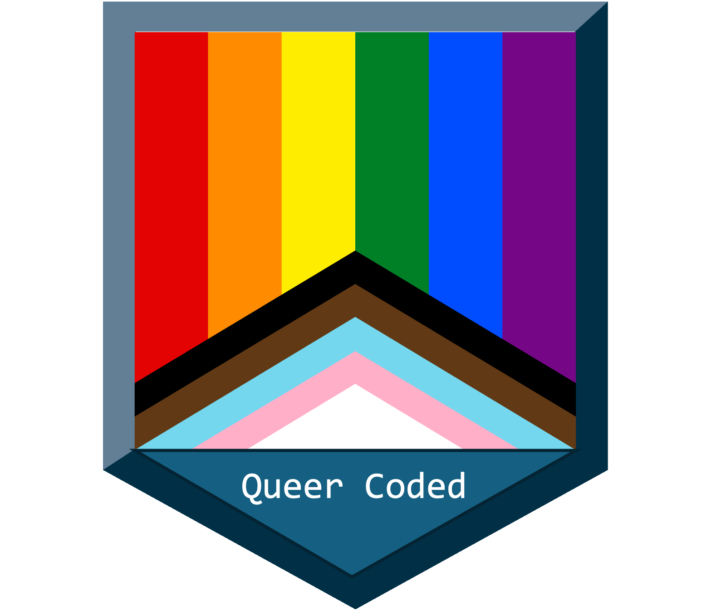
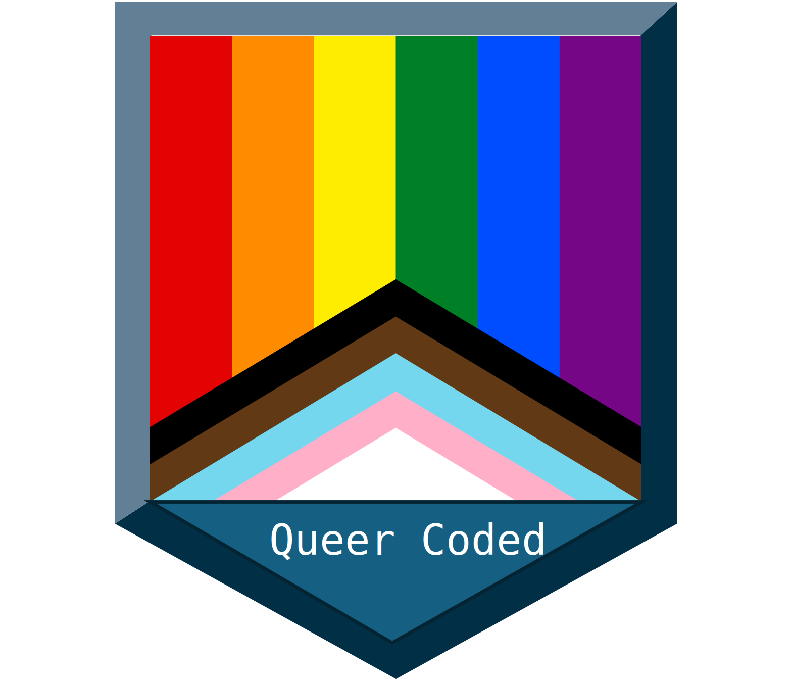
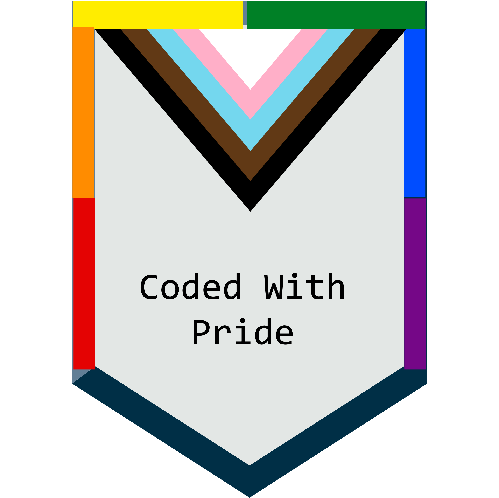
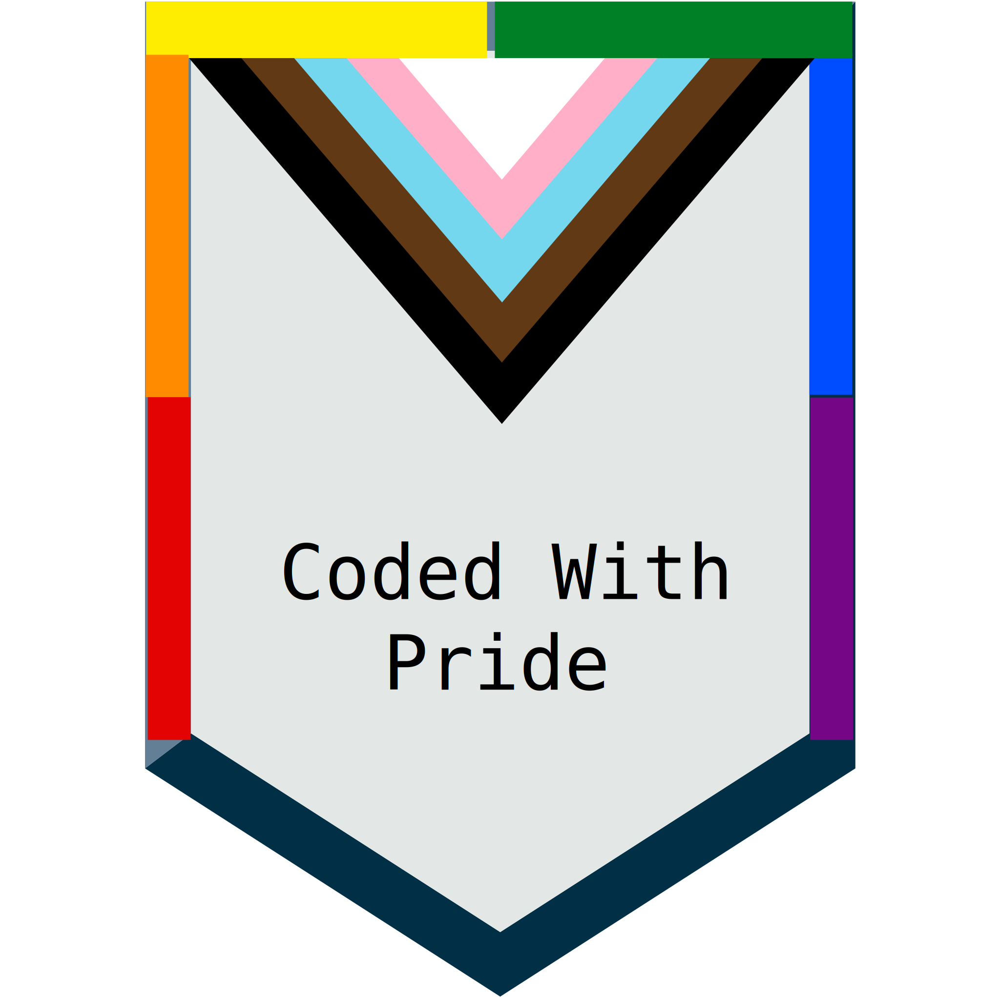

The project has created images for reuse by the community. These can be downloaded as either PNG or SVG files.

::: {.callout-note}
These are placeholder images - they will be refined!
:::

## Queer Coded

Use this image to indicate that your project has been developed by members of the LGBTQ+ community.

:::: {layout="[ 45, -10, 45 ]"}

::: {#first-column}

:::

::: {#second-column}

:::

::::

## Coded With Pride

Use this image to demonstrate support for the Coded With Pride project.

:::: {layout="[ 45, -10, 45 ]"}

::: {#first-column}

:::

::: {#second-column}

:::

::::

