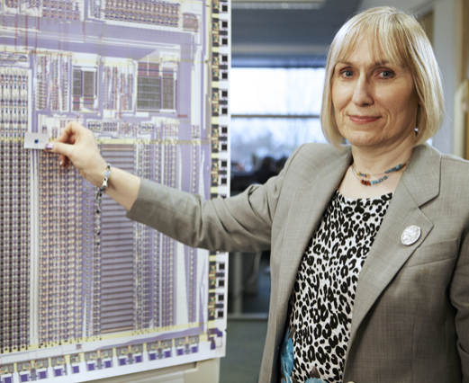

:::: {layout="[ 60, -5, 40 ]"}

::: {#first-column}
Sophie Wilson (born June 1957) is a British computer scientist best known for her central role in creating the BBC Micro computer, and designing the original ARM processor architecture. 

While working at Acorn Computers in the late 1970s and 1980s, she helped to develop BBC BASIC. Her work on ARM began as a project to build a fast, efficient processor for Acorn’s computers, but ARM later became the foundation for billions of devices, especially smartphones, tablets, embedded systems, and low-power computers.

She has received major recognition for her contributions, including being elected a Fellow of the Royal Society. Her career helped shape both personal computing education and modern mobile computing. 

Wilson's success challenges the idea that LGBTQ+ people, and especially trans people, are marginal to science and engineering. Wilson’s career shows that a trans woman was central to one of the most important technological developments of the late twentieth century.
:::

::: {#second-column}

{width=100%, fig-align=center}

[Photo credit](https://en.wikipedia.org/wiki/Sophie_Wilson#/media/File:Sophie_Wilson.jpg), available under CC BY 2.0 
:::

::::